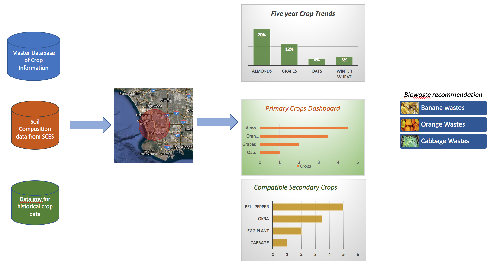

# Pocket Botanist{#Care-for-soil}

#### Keywords

Soil Quality, Soil erosion, Water erosion, Wind erosion, primary crops , Secondary crops, Bio wastes, Soil Composition

## Current State(Degradtion of Soil Quality).

Evolving agricultural practices have contributed immensely to the progress of civilization. Modern farming techniques have helped farmers to improve yields, keep pests at bay and optimize resource utilization. While this has helped us to ensure availability of food for the growing population in most parts of the world, it has also resulted in the degradation of soil quality which is leading to soil erosion. There are numerous researches conducted in this field to find the right balance between improving crop yields and maintaining soil quality. These researches point to adopting certain proven farming techniques to reduce the pace of soil degradation and to aid the process of regeneration of nutrients in soil. Multiple cropping is one such technique and this solution will focus on this technique.

## Data-driven Solution.

The intention is to provide a pocket guide to the farmers that they can use as their first level reference to multiple cropping based on geography and crop specific parameters. The solution will also suggest organic wastes that the farmer can use as manure to improve the nutrients required for the crops that will be grown in the land.

The solution will be split into three parts, the first is to provide a crop growth and yield trend over the past 5 or 10 years to the farmer. This would help new farmers who may have leased a piece of land to understand how the soil has been used historically.

The second part of the solution is to suggest primary and secondary crops that can be grown in the land based on the soil type, mineral composition and soil PH. This step requires two sets of data i.e. geography wise soil composition and a master crop database that records requisites to grow any specific crop. Soil composition of the geography selected by the user will be matched with the requisites in the master crop database and the suggestion engine will provide a list of suitable primary crops and associated secondary crops. Combining a secondary crop with primary is called mixed cropping and its one of the most acknowledged method of cultivation to improve soil quality and check water and wind erosion. Suggestion of secondary crops will consider compatibility with the primary crop so that they do not compete for nutrients and water. 

Web Soil Survey initiative by the United States Department of Agriculture collects data about soil conditions throughout the US and the proposal is to use this data. But the master crop database needs to be built in collaboration with botanists and researchers.

Using the master crop database the solution would also help to identify bio wastes that could be used as manure to enrich the soil with essential nutrients for the suggested crops. This information is provided in the form of bio waste recommendation dashboard.

## Future State.

This solution provides farmers access to data driven research in the form of simple dashboards. The fact that the yield of the Secondary crop is an additional contributor to the farmer’s income makes it financially attractive. 

From a soil conservation perspective, since more percentage of crop land is now covered with vegetation it directly counteracts soil erosion caused due to run-away water and heavy wind. The usage of bio waste will also aid the regeneration of nutrients in the soil without the harmful side-effects of using chemical manures. The crop residue from secondary crops could also be ploughed into the land as another source of natural manure.

### Limitations

1. The master crop database with specific parameters for all crops grown in a country is time and effort intensive. As the first step this database could be compiled for a small region to develop a prototype and pitch the solution for wider implementation. 
2. Other factors such as climatic conditions and availability of irrigation in a geographic region also play a major role in growth of crops. Though in its current form the solution doesn’t consider these points, they could be explored

### Sources 

1.	Soil Erosion Case study : http://www.recare-hub.eu/soil-threats/soil-erosion
2.	Multiple cropping: https://dl.sciencesocieties.org/publications/books/abstracts/asaspecialpubli/multiplecroppin/317?access=0&view=pdf
3.	Mixed Cropping : https://www.thoughtco.com/mixed-cropping-history-171201
4.	Soil composition Parameters & Details : https://theses.lib.vt.edu/theses/available/etd-093099-180817/unrestricted/Chapter5.PDF
5.	Soil erosion prediction and modeling : http://www.sciencedirect.com/science/article/pii/S2095633915300344
6.	Fruit and Nut Research and information center http://fruitsandnuts.ucdavis.edu/almondpages/AlmondOrchardManagement/
7.	Natural resource conservation service soils (USDA)  Soil Survey by state:                    https://www.nrcs.usda.gov/wps/portal/nrcs/surveylist/soils/survey/state/?stateId=CA
8.	Geo Spatial Gateway : https://gdg.sc.egov.usda.gov/
9.	Web Soil survey data: https://websoilsurvey.sc.egov.usda.gov/App/WebSoilSurvey.aspx

